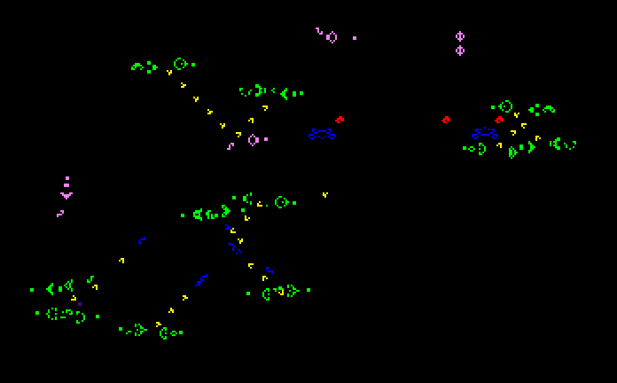
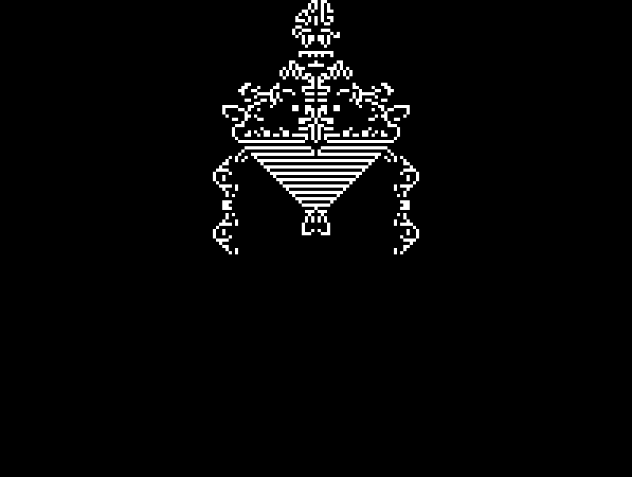
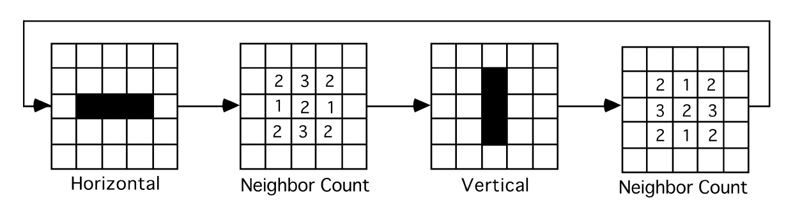
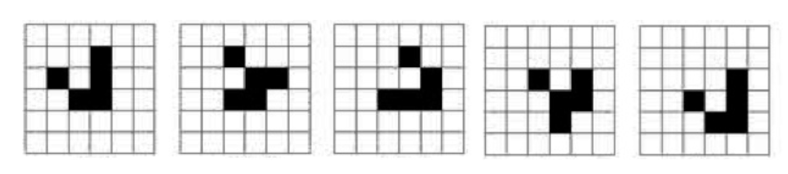
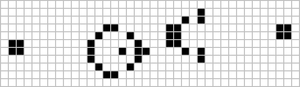

# Conway's Game of Life

The [Game of Life](https://en.wikipedia.org/wiki/Conway%27s_Game_of_Life), also known simply as Life, is a cellular automaton devised by the British mathematician [John Horton Conway](https://en.wikipedia.org/wiki/John_Horton_Conway) in 1970.

The "game" is a zero-player game, meaning that its evolution is determined by its initial state, requiring no further input. One interacts with the Game of Life by creating an initial configuration and observing how it evolves, or, for advanced "players", by creating patterns with particular properties.

**[Racetrack in Conway's Game of Life](https://en.wikipedia.org/wiki/File:Colour_coded_racetrack.gif)**

**[Halfmax (Spacefiller) in Conway's Game of Life](https://imgur.com/gallery/7ois83S)**

## Description

The goal of this project is to create a simulation of Conway’s Game of Life using two dimensional arrays. Use [Simple and Fast Multimedia Library (SFML)](https://www.youtube.com/playlist?list=PLHJE4y54mpC5j_x90UkuoMZOdmmL9-_rg) for Graphical User Interface (GUI). Each element of the array represents cell that is either alive or dead. Once an initial state is setup, the program will generate new generations based on the following [Rules of the Game](./docs/description.pdf):
 
- A live cell with two or three live neighbors will remain alive.
- A live cell with fewer than two live neighbors will die.
- A live cell with more than three live neighbors will die.
- A dead cell with exactly three live neighbors will become a live cell.
 
The “neighbors” of cell are the adjacent and diagonal cells.

## Purpose

- Design: You will be building function hierarchy that will make managing this process easier. Low level functions that will act as tools on top of which higher level functions will be built upon. This is the most important part of this project as we spent a great deal of time talking about this issue not to mention all the projects we built with these ideas in mind.
- Flow of Control: The process of creating consecutive generations will be near impossible to do without using various nested loops.
- Functions: There will be many functions used to breakdown the project into specific tasks that must be performed each time new generation is generated.
- Input/Output streams: Files will be used to import and export pattern or generation’s current state.
- Arrays: This is the heart of the project; a two-dimensional array is used to represent generation of cells, with each element of the array representing an individual cell.

## Design Specifications
 
There must be temporary holding place for each new generation:
 
- Main Two Dimensional Array: There will be a main 2-Darray that will represent the state of the current generation.
- Temporary Array: When creating the next generation, changes made to the main array will interfere with the current generation’s actual state. The temporary array will be used to determine which cells in the next generation are alive and which are dead. Once every cell has been processed, transfer the temporary cell’s state to the main array so that the process may be repeated.

### CIRCULAR

The board is virtually connected by the edges and the corners:
- The first row and the last row are neighbors (adjacent) and the first column and the last column are neighbors (adjacent) so, cell on the first row will have neighbors on the last row.
- Consider the example of the top-­-left corner cell: This cell must be able to use the last 2 cells on the bottom, the last 2 cells on the right, and the lower-right corner cell as its neighbors. By using the border to reflect those cells, the task of checking the neighbors of the corner cell is greatly simplified.

### SAVE/LOAD
Patterns can be exported and imported to and from text files.

The text files will simply be characters used to represent consecutive cells as either alive or dead, separated by line breaks to differentiate between rows.
 

### MENU
These are necessary functions:
#### Displaying Generations:
- Step: Display the next generation.
- Go: Loop consecutive generations.
- Pause: Pause at specific generation.
 
#### Input/Output files:
- Save Pattern: Save specific pattern to file. Will need two sets of coordinates representing the top-left cell and bottom-right cell in which the pattern is contained.
- Load Pattern: Import a pattern from a file into the array. Will need a single set of coordinates to indicate where the pattern will begin.
- Save Screen: Save the entire two-­-dimensional array to a file.
- Load Screen: Import a saved screen into the array. Useful for testing the Save Screen function.
 
#### Altering the Cells:
- Random: Add 50 random live cells to the world.
- Bring To Life: Bring the cell at a specific set of coordinates to life.
- Kill: Kill specific cell.
- KillAll: Clear the entire array.

## Common Patters
### Blinker

**Hint: Useful during initial stages of testing.**
 
### Glider

**Hint: Useful for testing the edges of the array. If the edge cells are connected properly, the glider should reappear in the top-left corner when it reaches the bottom-right.**

### Gosper Glider Gun

"Gosper glider gun" produces its first glider on the 15th generation, and another glider every 30th generation from then on. For many years this glider gun was the smallest one known. In 2015 a period-120 gun (the Simkin glider gun) was discovered that has fewer live cells but a larger bounding box.

**Gosper glider gun pattern**

**A single Gosper's glider gun creating "gliders"**

