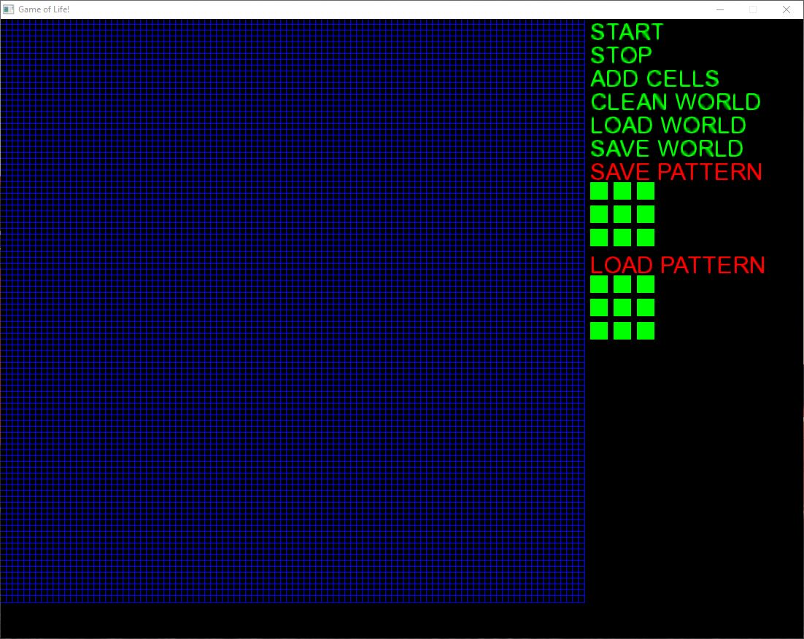
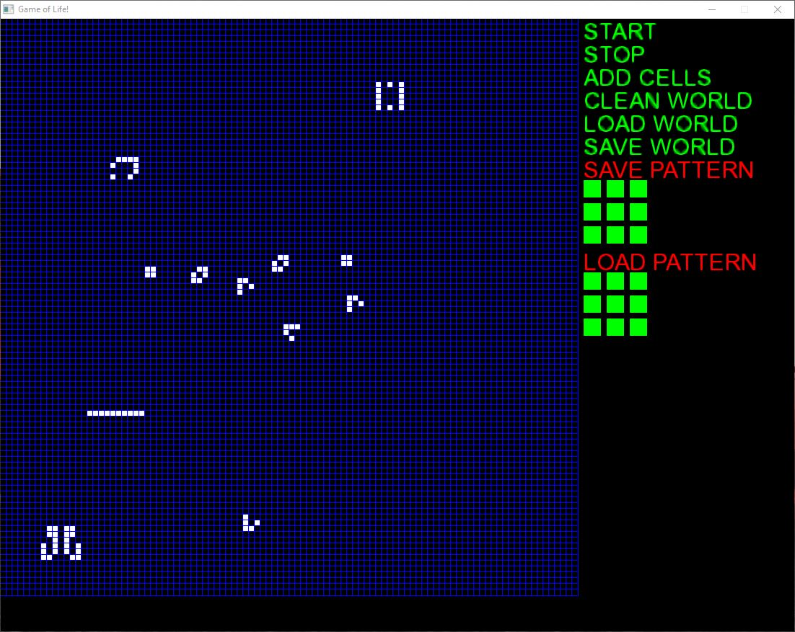
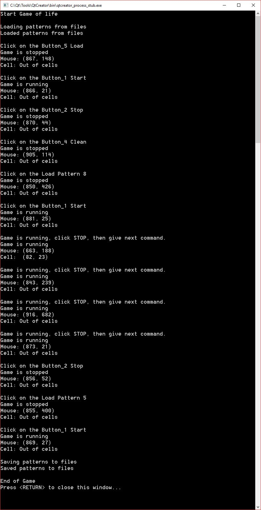

# Conway's Game of Life

The [Game of Life](https://en.wikipedia.org/wiki/Conway%27s_Game_of_Life), also known simply as Life, is a cellular automaton devised by the British mathematician [John Horton Conway](https://en.wikipedia.org/wiki/John_Horton_Conway) in 1970.

The "game" is a zero-player game, meaning that its evolution is determined by its initial state, requiring no further input. One interacts with the Game of Life by creating an initial configuration and observing how it evolves, or, for advanced "players", by creating patterns with particular properties.

**[Racetrack in Conway's Game of Life](https://en.wikipedia.org/wiki/File:Colour_coded_racetrack.gif)**

## Description

The goal of this project is to create a simulation of Conway’s Game of Life with C++ language, using [Simple and Fast Multimedia Library (SFML)](https://www.sfml-dev.org/) for Graphical User Interface (GUI). Each element of the array represents cell that is either alive or dead. Once an initial state is setup, the program will generate new generations based on the following rules:

- A live cell with two or three live neighbors will remain alive.
- A live cell with fewer than two live neighbors will die.
- A live cell with more than three live neighbors will die.
- A dead cell with exactly three live neighbors will become a live cell.

The **neighbors** of cell are the adjacent and diagonal cells. 
> total neighbors number of one cell is 8.

## GUI

### Menu

- `START`: Start the game
- `STOP`: Pause the game
- `ADD CELLS`: Rondom add 50 cells into the world
- `CLEAN WORLD`: Kill all live cells in world
- `LOAD WORLD`: Load the exsiting world from database
- `SAVE WORLD`: Save the current world
- `SAVE PATTERN`: Save current world as a pattern
- `LOAD PATTERN`: Load an exsiting world from database

**Note**: Green buttons could be clicked, and click on the square `boxes` instead of text of `SAVE PATTERN` and `LOAD PATTERN` to save or load pattern.

### Windows

#### Main GUI

#### Load world

### Console

This is an `Console Application`, so that you could trace every position you clicked on screen, so it is easy to modify the code. When you are ready to publish the game, just creat a `Window Application` with same code.

#### Console window

**Note**: if you want to know more coding structure about game, you could look at the [desgin of game](./docs/description.pdf).

## Compile

### Installation

- `C++ IDE`: I rececommend [Visual Studio ](https://visualstudio.microsoft.com/vs/), you could also use [Qt Creator](https://www.qt.io/), a good IDE for GUI, or other IDEs you like to use.
- `GUI Library`: We are using **SFML** for this GUI, you could download the library [SFML download page](https://www.sfml-dev.org/download.php). After download it, you should visit the [tutorial page](https://www.sfml-dev.org/learn.php) to learn how to import SFML lib to your IDE. 
Also, there is a [youtube video ](https://www.youtube.com/watch?v=axIgxBQVBg0) teach us how to follow the tutorial, I recommend you watch this video, it will make your life easier.

### Run

- Create a new `Window Console Application` project.
- Copy and paste all `.cpp` files in `src` to `Source Files` folder.
- Copy and paste all `.hpp` files in `src` to `Header Files` folder.
- Copy and paste all files in `debug` folder to your `debug` folder.
- Run and enjoy the game.

> Thanks for looking at this project, if you have any question, feel free to visit my website: [zhongqi1112.me](http://zhongqi1112.me/)
